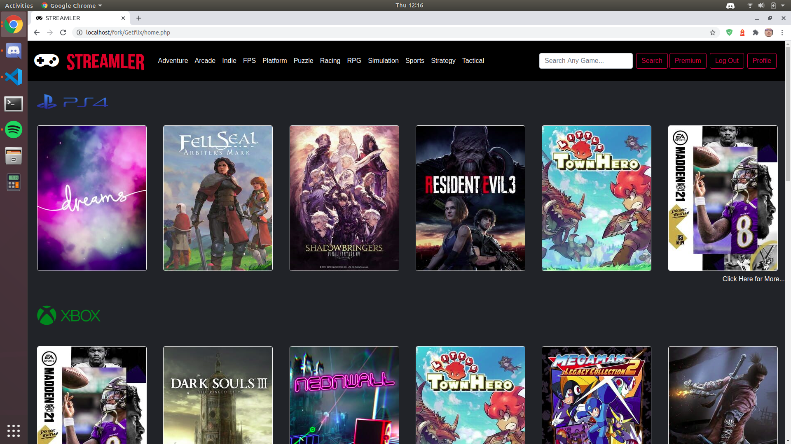
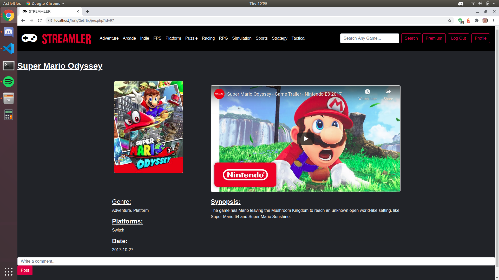

# Streamler

## Introduction

Vous trouverez ici un projet qui avait pour but de renforcer nos connaissance dans l'usage du language PHP et Mysql.  
Afin d'implémenter ce projet il nous a été demandé de réaliser un site web représentant une plateforme de streaming tel que Netflix, Amazon video mais sur le thème du jeu vidéo.  
Durée approximative du projet 10 jours.

Il s'agit d'un excercice réalisé durant la formation chez BeCode de Junior Web Dev.  

lien vers le repo énoncé du challenge : [içi](https://github.com/becodeorg/BXL-Swartz-3-21/blob/master/06-PHP/getflix_project.md)

## Langages utilisés

+ HTML5
+ CSS3  
+ JS
+ PHP, MySQL
+ Bootstrap4

## Responsive

Déjà inclus dans le framework Bootstrap.

## Team

Réalisation :En equipe de 4.  

+ Laurent Lonchay : https://github.com/LaurentLonchay  
+ Sébastien Meunier : https://github.com/MeunierS/  
+ Olivier Peeters : https://github.com/OlivierPeeters73  
+ Kevin Schoenaers : https://github.com/schoenaerskevin

## Liens vers la page  

[Içi](http://streamler.epizy.com/index.php)  

## Progression

Début : 24/08/2020

Béta : 01/09/2020  

v1.0 : 10/09/2020

## Historique

+ 24/08/2020 : création du readme, mise en place de la to do list via "trello, maquettage,bdd film via api et trouver un hebergeur gratuit supportant le php.
+ 25/08/2020 : plan du  site et et maquettage  base de donnée, uniformisation de la structure de la base de donnée, implémentation du random games,création des pages dynamiques de jeu.
+ 26/08/2020 : résolution problème d'affichage du random, résolution de l'inscription via plusieurs table dans la base de données (problème de sécurité).
+ 27/08/2020 : début de l'affichage du contenu de la page d'accueil, finalisation de l'option de déconnexion.
+ 28/08/2020 : fin des pages jeu dnamique, fin du random games, création du back-office admin.
+ 31/08/2020 : implémentation du chat,finition de la partie admin, implémentation de la suppresion du profil de l'utilisateur, gestion des différents droits de l'utilisateur.
+ 01/09/2020 : mise en place des pages de filtres, mise en place de la barre de recherche, inversion des boutons log in/log out en fonction du status de connexion, formatage du code PHP.
+ 02/09/2020 : mise en beauté du site, uniformisation du PDO, modification du chat, début de la mise en place de la récupération de mot de passe.
+ 03/09/2020 : mise en ligne du chat, test de celui-çi, problème de refresh détecté, refonte graphique du site en cours.
+ 04/09/2020 : début de refonte graphique complète du site, partie admin.
+ 08/09/2020 : changement d'hébergeur.
+ 09/09/2020 : transformation de la partie chat en partie commentaires déplacé sur la partie jeu.
+ 10/09/2020 : merge final sur nv design et correction bug.

## Poste occupé durant la Réalisation

**Junior Web Dev chez Becode**

+ Laurent : Codeur
+ Olivier :  Codeur
+ Sébastien : Project Manager & Codeur
+ Kevin : Git master via pull request & Codeur

## Screenshots

 
 

## Credits

[badges](https://shields.io/)  
[IGBD](https://www.igdb.com)